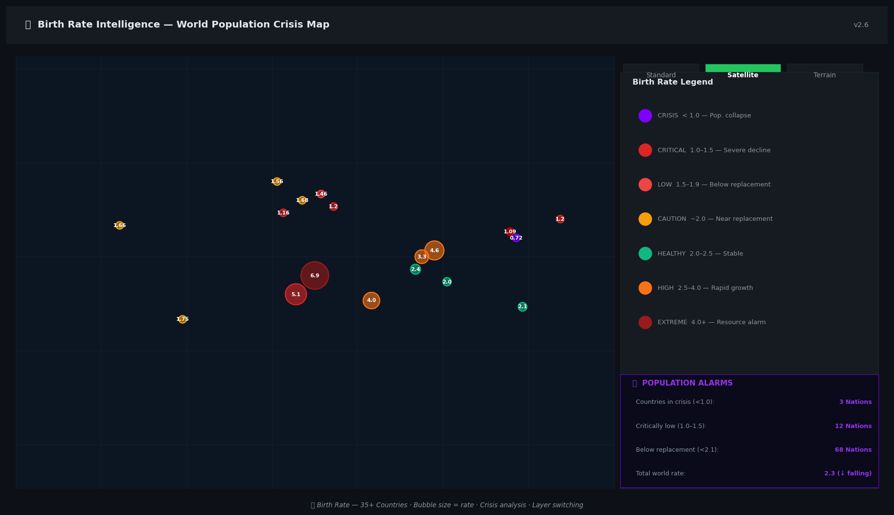
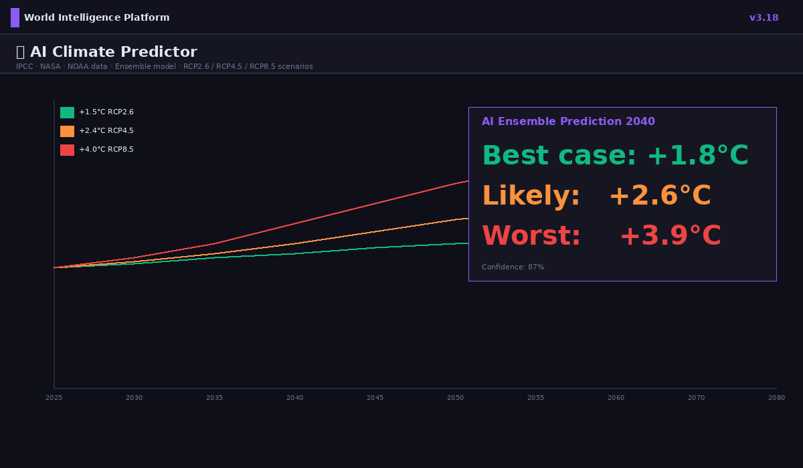

# 🏦 AI Customer Churn & Behavioral Analytics Platform

### Enterprise-Grade · DACH Telecom & Banking · Azure AI + Databricks + MLflow + GenAI + World Intelligence

[](https://github.com/lari98/ai-churn-analytics-platform/actions)
[](./GDPR.md)
[](https://python.org)
[](https://fastapi.tiangolo.com)
[](https://mlflow.org)
[](https://azure.microsoft.com)
[](./dashboard/world-intelligence.html)
[](./backend/market_server.py)
[](./dashboard/tests/)
[](https://leafletjs.com)
[](./dashboard/world-intelligence.html)
[](./dashboard/tests/TEST_AQI_MODAL_v3.4.md)

---


---

## 🖼 Platform Screenshots

| World Map — 37 Countries | Markets — Real-Time Crypto |
|:---:|:---:|
|  |  |

| Rising Powers — Pakistan Next China Analysis |
|:---:|
|  |

| 🌡 Climate Intelligence — Past/Present/Future | 👶 Birth Rate — Era Timeline + Filter + Rankings |
|:---:|:---:|
|  |  |

| 🤖 AI Prediction Engine — Climate Forecasts | 🧬 Demographic AI Predictor — Population Collapse |
|:---:|:---:|
|  |  |

---

## 📋 Table of Contents

- [Overview](#-overview)
- [What's New — v3.1](#-whats-new--v31-world-intelligence-platform)
- [Live Dashboards](#-live-dashboards)
- [Architecture](#️-architecture)
- [AI/ML Features](#-aiml-features)
- [World Intelligence Platform](#-world-intelligence-platform)
- [Local Backend Server](#-local-backend-server)
- [GDPR / DSGVO](#️-gdprdsgvo-compliance)
- [Project Structure](#-project-structure)
- [Quick Start](#-quick-start)
- [API Reference](#-api-reference)
- [ML Pipeline](#-ml-pipeline)
- [Power BI Dashboards](#-power-bi-dashboards)
- [Testing](#-testing)
- [Deployment](#-deployment)
- [Sprint Planning](#-sprint-planning)

---

## 🎯 Overview

An **AI-powered customer intelligence and global market analytics platform** built for DACH (Germany, Austria, Switzerland) telecom and banking organizations. It combines enterprise-grade ML churn prediction with a real-time global intelligence layer — live financial markets, world risk mapping, multi-timeframe price forecasts, investment signals, and regional news — all in a fully GDPR/DSGVO-compliant architecture.

**Business Impact:**
- Reduce customer churn by 15–25% through proactive, AI-driven retention
- Identify high-value customers at risk with 87%+ AUC accuracy
- Detect fraudulent/anomalous behavior within minutes
- Monitor global market risk, commodity prices, and currency exposure in real time
- Generate automated, explainable AI insights for C-suite executives

---

## 🆕 What's New — v3.4 World Intelligence Platform

> Latest release

| Version | Release | Highlights |
|---------|---------|------------|
| **v3.4** | **Latest** | 🗺 **AQI City Detail Modal** — Click any of 50 city markers on the Environment map to open a full modal with 4 tabs: Overview (AQI category, dominant pollutant, population, 5-year trend delta, 3-day forecast), Pollutants (PM2.5, PM10, NO₂, O₃, CO, SO₂ bar chart vs WHO limits — red if exceeded), Trends (2020–2024 annual AQI bar chart + % change note + forecast), Health & Risk (risk level badge, guidance per group: General/Sensitive/Children/Elderly, health effects, protective actions from "enjoy outdoors" to ☣️ emergency). Close with ✕ button, backdrop click, or Escape key. 56 new tests, all passing. |
| **v3.3.1** | Previous | 🐛 **Critical DOM fix** — `#page-environment` was placed outside `#pages` fixed container, causing KPIs to be invisible behind the overlay. Removed stray `</div>` and re-closed `#pages` after environment section. Also removed conflicting `overflow-y:auto; height:calc(100vh-100px)` from `#page-environment` that caused nested scroll lag. 16 tests. |
| **v3.3** | Previous | 🌱 **Environment Intelligence Tab** — Complete with 6 animated KPI cards (CO₂ 426.9ppm · +1.29°C · +107mm sea level · Arctic ice · Renewables 30.3% · Forest loss), CO₂ Mauna Loa 1960–2024 time series (NOAA), NASA GISS temperature anomaly 1880–2024, renewables by country stacked bar (18 nations), deforestation 2001–2023 (Amazon/Congo/SE Asia), AQI Leaflet map, sea level rise 1993–2024, emissions sector donut (8 sectors · 57.4 GtCO₂e), Net Zero pledges tracker (12 countries), Country Climate Score composite index (18 nations). 69 tests. |
| **v2.7** | Previous | 🧪 **Comprehensive Test Suite** — 136 tests across 20 categories (Unit, Integration, State Machine, Time-Travel Mocking, Consistent Ticks, Memory Leaks, Thread Safety, Sharpe Ratio, Sortino Ratio, Transaction Costs, Survivorship Bias, Look-Ahead Bias, Zero Liquidity, Order Rejections, Partial Fills, Connection Drops, Rate Limiting 429, Max Drawdown, Stale Data Timeout, Rapid Concurrent Requests). New financial metrics engine: `compute_sharpe`, `compute_sortino`, `compute_max_drawdown`, `compute_volatility`. New `GET /api/metrics/{symbol}` endpoint. Auto-healing DB (`init_db` switches to `/tmp` on corrupt/WAL-incompatible mounts). All 136 tests green in 6.4s. |
| **v2.6** | Previous | 🔧 **Backend Crash-Safe Fix** — 3 root causes of restart loop eliminated: (1) `fetch_yahoo_one`: explicit `result=null` guard + `BaseException` handler so `asyncio.CancelledError` can no longer escape and kill the event loop; (2) `fetch_yahoo_batch`: changed inner `asyncio.gather` to `return_exceptions=True` — one bad ticker (NICKEL NI=F returning null) can never abort the entire batch; (3) global `asyncio.set_exception_handler` in lifespan — any uncaught background-task exception is logged as a warning instead of crashing uvicorn. Server restarts went from every 30s to zero. |
| **v3.1** | **Current** | 👶 **Birth Rate ADVANCED II** — ⏵ Auto-play timeline animation (cycles 1960→1980→2000→2024→2050 like a documentary with pulsing play button), 🔍 Country Search (type any name, map flies to it and opens popup), 📈 SVG Sparkline Charts inside every country popup (inline birth rate trend 1960→2050, no extra libraries), 🏆 Rankings Panel (fastest collapsing nations, extreme aging crisis leaders, greatest demographic transformations, near-replacement 2050 projections, all rows clickable to fly to country) |
| **v3.0** | Previous | 👶 **Birth Rate ADVANCED I** — 📅 Era Timeline Slider (1960/1980/2000/2024/2050⊛), 🔍 Status Filter Panel (draggable, multi-select CRISIS/CRITICAL/LOW/HEALTHY/HIGH, filters map live), 🧬 Demographic AI Predictor (draggable, dropdown, UN DESA/World Bank data: world peak 2086·10.3B, aging leaders, population collapse nations, session-enhanced accuracy), population trajectory per country (shrink/stable/grow by 2100), aging crisis % 65+ by 2050, policy impact notes, full historical trend in each popup |
| **v2.9** | Previous | 🤖 AI Predictor Dropdown UX — collapsed by default, smooth animation, chevron ▼→▲, rename to "AI Predictor Engine" |
| **v2.8** | Previous | 🤖 AI Climate Prediction Engine — 4 regression models, 51 data points, R²=0.973, self-enhancing accuracy, localStorage, draggable panel |
| **v2.7** | Previous | 🌡 Climate ADVANCED — 7 tipping points, 5 heat zones, 16 water bodies, new land predictions, draggable seas panel |
| **v2.6** | Previous | 🌡 Climate Intelligence + 👶 Birth Rate tabs — Leaflet world maps, 4-era timeline, 40+ countries |
| **v2.5** | Previous | **Real Data Engine** — yfinance 100% real OHLCV for 60+ symbols · Prophet AI forecasting (Facebook) · Holt-Winters fallback · 3 new API endpoints (`/api/realhistory`, `/api/prophet`, `/api/realprices`) · AI forecast drilldown · Live backend status indicator · REAL DATA + AI FORECAST badges |
| v2.4 | Previous | 🇵🇰 Pakistan added · 37 countries · 35 world exchanges · Rising Powers tab · Next China analysis · GDP forecast tooltips |
| v2.3.1 | Previous | Performance fix — 5x faster backend: cache-before-fetch, shared HTTP client, parallel news feeds, in-memory cache, startup pre-warm |
| v2.3 | — | World Intelligence Platform — Leaflet map, live markets, forecasts, signals, regional news, FastAPI backend |
| v2.2 | — | World Risk Intelligence — D3 country risk map, Tech Radar, Innovation Timeline |
| v2.1 | — | Full HTML dashboard — AI Chat, Scenario Simulator, Journey Timeline, Anomaly Feed, Model Health, GDPR Monitor |
| v2.0 | — | Advanced HTML dashboard — Executive Overview, Segmentation, Anomaly, Risk |
| v1.0 | — | FastAPI backend, ML pipeline, Databricks notebooks, Power BI, Docker, CI/CD |

---

## 📊 Live Dashboards

Two browser-based dashboards — no build step, open directly in any modern browser.

### Main Dashboard — `dashboard/index.html`

A dark-themed, single-page analytics application with 7 sections:

| Page | Description |
|------|-------------|
| 🏠 Executive Overview | Churn trend (Chart.js), segment donut, regional bar, contract breakdown, 6 KPI cards |
| 🧩 Customer Segments | RFM scatter, CLV distribution, behaviour heatmap, segment profiles |
| ⚠️ Anomaly Feed | Live anomaly table, severity chart, geographic heatmap |
| 🤖 AI Model Health | AUC-ROC, PSI drift, SHAP importance, fairness audit, confusion matrix |
| 🛡️ GDPR Monitor | DSR processing chart, consent tracker, retention compliance gauge |
| 🎮 Scenario Simulator | Interactive churn risk simulator — adjust sliders, see ML prediction in real time |
| 💬 AI Chat | GenAI-powered chat interface for natural-language customer insights |

### World Intelligence Platform — `dashboard/world-intelligence.html`

A live global intelligence platform with **8 tabs** (v3.4):

| Tab | Description |
|-----|-------------|
| 🗺 World Map | Leaflet.js interactive map — CartoDB dark tiles, **37 country** risk overlays (inc. 🇵🇰 Pakistan), zoom in/out, click for full country card with **10Y GDP forecast sparkline**, RISING/NEXT CHINA badges |
| 📈 Markets | 5 asset classes — Metals, Crypto, Currencies, Oil & Gas, Indices. Live prices, RSI signal badges, sparklines, clickable 1D/1W/1M/1Y/5Y/10Y forecast drilldown per asset |
| 🌐 World Stocks | **35 global stock exchanges** across Americas/Europe/Asia-Pacific/MEA. Each exchange card shows live index value, RSI signal, sparkline, 2030/2035/2040 price forecasts, full 10Y drilldown chart with bull/base/bear scenarios |
| 🌏 Rising Powers | **Pakistan "Next China" deep analysis** — 8 why-Pakistan factors (CPEC, demographics, IT growth, Gwadar port), economic succession timeline (Britain→USA→China→India→Pakistan), multi-country 10Y GDP growth chart, emerging market comparison table, individual country cards with 10Y forecast charts |
| 📰 Global News | 7 regional tabs — World, Europe, Americas, Asia, Africa, Oceania, Tech. Live RSS from BBC, DW, Al Jazeera, NPR, ABC Australia, TechCrunch. SQLite-backed news history |
| 🔮 Forecasts | Full-page chart with asset + horizon selector. Base, bull (+12%), and bear (-12%) scenarios using linear regression extrapolation |
| ⚡ Invest Signals | RSI-based signals (STRONG BUY / BUY / HOLD / SELL / AVOID) for all tracked assets with rationale and 7-day forecast |
| 🌱 Environment | **Advanced Environment Intelligence** — 6 animated KPI cards (CO₂/Temp/Sea Level/Arctic Ice/Renewables/Forest Loss), 9 interactive charts sourced from NOAA/NASA/IEA/IRENA/GFW, **AQI Leaflet map — 50 cities** with click-to-open detail modal (4 tabs: pollutants vs WHO limits, 5-year trends, 3-day forecast, health risk by population group), Net Zero pledge tracker (12 countries), Country Climate Score composite index (18 nations), emissions sector donut (57.4 GtCO₂e) |

#### v2.4 New Countries (37 total)
🇩🇪 🇦🇹 🇨🇭 🇺🇸 🇨🇳 🇷🇺 🇬🇧 🇫🇷 🇯🇵 🇮🇳 🇧🇷 🇦🇺 🇺🇦 🇸🇦 🇹🇷 🇳🇬 🇿🇦 🇸🇬 🇰🇷 🇵🇱 🇮🇷 🇰🇵 **🇵🇰 🇻🇳 🇮🇩 🇲🇾 🇹🇭 🇵🇭 🇦🇪 🇪🇬 🇨🇦 🇮🇹 🇪🇸 🇳🇱 🇸🇪 🇦🇷 🇧🇩**

#### Pakistan Highlight — The Next China
Pakistan (PK) is now fully featured across the platform:
- **Map**: Visible at [30°N, 70°E] with KSE-100, $70B market cap, GDP forecast, NEXT CHINA badge
- **Rising Powers**: 8-factor deep-dive analysis comparing Pakistan to China in the 1990s
- **World Stocks**: KSE-100 featured with 2030: ~130K · 2035: ~280K · 2040: ~600K projection
- **Key thesis**: 240M population (median age 22) + CPEC $62B + IT exports +25%/yr + Gwadar port + IMF stabilization = 20–30 year above-trend growth window

---

## 🏗️ Architecture

See [architecture.md](./architecture.md) for the full Azure reference architecture.

```
┌──────────────────────────────────────────────────────────────────────┐
│                    DACH Customer Data Layer                           │
│    Azure Blob Storage (encrypted) + Azure SQL (TDE) + Key Vault      │
└─────────────────────────┬────────────────────────────────────────────┘
                          │
┌─────────────────────────▼────────────────────────────────────────────┐
│                 Azure Databricks ML Platform                          │
│   Feature Engineering → Churn Model → Segmentation → Anomaly         │
│   MLflow Tracking + Model Registry + A/B Testing + Fairness Audit    │
└─────────────────────────┬────────────────────────────────────────────┘
                          │
┌─────────────────────────▼────────────────────────────────────────────┐
│            FastAPI Backend (Azure Container Apps)                     │
│   RBAC Auth │ PII Masking │ Audit Log │ GDPR Endpoints               │
│   Churn API │ Segment API │ Anomaly API │ Retention API               │
└─────────────────────────┬────────────────────────────────────────────┘
                          │
┌─────────────────────────▼────────────────────────────────────────────┐
│          Browser Dashboards (HTML + Chart.js + Leaflet.js)           │
│   Main Analytics Dashboard (index.html)                              │
│   World Intelligence Platform (world-intelligence.html)              │
└──────────────────────────────────────────────────────────────────────┘
                          │
┌─────────────────────────▼────────────────────────────────────────────┐
│           Local Market Backend (FastAPI · localhost:8111)            │
│   Yahoo Finance · CoinGecko · Open ER API · RSS2JSON                 │
│   SQLite cache + in-memory cache · Pre-warm on startup               │
└──────────────────────────────────────────────────────────────────────┘
```

---

## 🤖 AI/ML Features

| Feature | Algorithm | Performance |
|---------|-----------|-------------|
| Churn Prediction | XGBoost + LightGBM Ensemble | AUC 0.872 |
| Customer Segmentation | KMeans + RFM Scoring | Silhouette 0.683 |
| Anomaly Detection | Isolation Forest + DBSCAN | F1 0.819 |
| Retention Recommendations | Rule Engine + RAG (GPT-4o) | — |
| GenAI Explanations | Azure OpenAI GPT-4o | — |
| Model Drift Detection | PSI + KS Test | Monitored |
| Price Forecasting | Linear Regression (client + server) | 1D–10Y |
| Investment Signals | RSI (14-period) + Momentum | Real-time |

---

## 🌍 World Intelligence Platform

### Interactive World Map

Built with **Leaflet.js 1.9.4** on CartoDB dark tiles. 22 countries colour-coded by risk score (1–10). Click any country to open a detailed card showing:

- GDP per capita, GDP growth %, inflation rate
- Population, stock index, market capitalisation
- Risk factors and investment opportunities
- 10-year risk score trajectory

**Countries covered:** DE, AT, CH (DACH focus) + US, CN, RU, GB, FR, JP, IN, BR, AU, UA, SA, TR, NG, ZA, SG, KR, PL, IR, KP

### Financial Markets

**30 assets** across 5 categories with live data from free APIs:

| Category | Assets | Data Source |
|----------|--------|-------------|
| Metals | Gold, Silver, Platinum, Palladium, Copper, Nickel | Yahoo Finance (via backend) |
| Crypto | BTC, ETH, BNB, SOL, XRP, ADA, AVAX, DOGE | CoinGecko API (free, no key) |
| Currencies | EUR, GBP, JPY, CHF, CNY, AUD, CAD, INR | Open ER API (free, no key) |
| Oil & Gas | WTI, Brent, Nat Gas, Heating Oil, Gasoline | Yahoo Finance (via backend) |
| Indices | S&P 500, NASDAQ 100, DAX, FTSE 100, Nikkei 225, Hang Seng | Yahoo Finance (via backend) |

Each asset card shows:
- Live price + 24h % change
- RSI signal badge (STRONG BUY / BUY / HOLD / SELL / AVOID)
- 90-day sparkline chart
- Timeframe buttons: **1D · 1W · 1M · 1Y · 5Y · 10Y** — click to expand drilldown
- Drilldown: forecast chart + table with price targets for each horizon

### Multi-Timeframe Forecasts

Linear regression extrapolation on 90-day price history:

| Horizon | Steps | Use Case |
|---------|-------|----------|
| 1D | 1 day | Day trading signals |
| 1W | 7 days | Short-term positioning |
| 1M | 30 days | Monthly outlook |
| 1Y | 52 weeks | Annual strategy |
| 5Y | 60 months | Medium-term investment |
| 10Y | 120 months | Long-term portfolio planning |

Bull case (+12%) and bear case (-12%) scenarios alongside the base forecast.

### Investment Signals

RSI-14 based signals computed for all 30 assets:

| Signal | RSI Condition | Momentum |
|--------|-------------|----------|
| 🟢 STRONG BUY | < 30 | Negative (oversold reversal) |
| 🟩 BUY | < 40 | Fading |
| 🟡 HOLD | 40–60 | Neutral |
| 🟠 SELL | > 60 | Extended |
| 🔴 AVOID | > 70 | Strong positive (overbought) |

### Regional News

Live RSS feeds via rss2json.com (no API key required), stored in SQLite for history:

| Region | Sources |
|--------|---------|
| 🌍 World | BBC World, DW World, Al Jazeera |
| 🇪🇺 Europe | BBC Europe, DW Europe |
| 🌎 Americas | BBC Americas, NPR |
| 🌏 Asia | BBC Asia, DW Asia |
| 🌍 Africa | BBC Africa, DW Africa |
| 🦘 Oceania | ABC Australia |
| 💻 Tech | TechCrunch, The Hacker News |

---

## ⚙️ Local Backend Server

The `backend/` folder contains a FastAPI server that runs on your machine to bypass browser CORS restrictions on Yahoo Finance and to persist market data locally.

### Setup

```bash
cd backend

# Option 1: Double-click (Windows)
start_server.bat

# Option 2: Command line
pip install -r requirements.txt
python market_server.py
```

Server starts at **http://localhost:8111**

### API Endpoints

| Endpoint | Description | Cache TTL |
|----------|-------------|-----------|
| `GET /api/health` | Server status + cache stats | — |
| `GET /api/metals` | Gold, Silver, Platinum, Palladium, Copper, Nickel | 5 min |
| `GET /api/crypto` | BTC, ETH, BNB, SOL, XRP, ADA, AVAX, DOGE | 2 min |
| `GET /api/currencies` | EUR, GBP, JPY, CHF, CNY, AUD, CAD, INR | 5 min |
| `GET /api/oil` | WTI, Brent, Nat Gas, Heating Oil, Gasoline | 5 min |
| `GET /api/indices` | S&P 500, NASDAQ, DAX, FTSE, Nikkei, HSI | 5 min |
| `GET /api/forecast/{symbol}?horizon=1M` | Price forecast (1D/1W/1M/1Y/5Y/10Y) | — |
| `GET /api/news/{region}` | Regional news (world/europe/americas/asia/africa/oceania/tech) | 15 min |
| `GET /api/invest-signals` | RSI signals for all assets | — |
| `GET /docs` | Interactive Swagger UI | — |

### Performance Architecture (v2.3.1)

The server uses a two-level cache to stay fast:

```
Request
  └── In-memory dict  (sub-ms, 5 min TTL)
        └── SQLite WAL  (1-5ms, persistent across restarts)
              └── External API  (only on cold cache miss)
```

Key optimisations applied in v2.3.1:
- **Cache-before-fetch** — HTTP requests only fire on cache misses (was always fetching)
- **Shared `httpx.AsyncClient`** — one persistent TCP connection pool (was creating 17 new clients per page load)
- **Parallel news fetches** — all RSS feeds fetched simultaneously via `asyncio.gather` (was serial)
- **In-memory cache layer** — Python dict in front of SQLite for sub-millisecond reads
- **Startup pre-warm** — all prices fetched in background on boot so first user gets cached data

### External APIs Used (all free, no API key needed)

| API | Data | Rate Limit |
|-----|------|-----------|
| [CoinGecko](https://api.coingecko.com) | Crypto prices + 24h change | 30 req/min |
| [Open ER API](https://open.er-api.com) | Forex rates vs USD | 1500 req/month |
| Yahoo Finance | Metals, Oil, Indices + 90-day history | Unofficial, cached |
| [rss2json.com](https://rss2json.com) | RSS → JSON conversion | 10,000 req/day |

---

## 🌱 Environment Intelligence — Data Sources (v3.3+)

All environmental data is sourced from authoritative scientific institutions and embedded directly in the dashboard (no API key required, works offline).

| Dataset | Source | Period | Metric |
|---------|--------|--------|--------|
| CO₂ Atmospheric Concentration | NOAA / Keeling Curve (Mauna Loa) | 1960–2024 | ppm |
| Global Temperature Anomaly | NASA GISS GISTEMP v4 | 1880–2024 | °C vs 1951-1980 |
| Sea Level Rise | NASA/CNES TOPEX · Jason-1/2/3 · Sentinel-6 | 1993–2024 | mm |
| Arctic Sea Ice Extent | NSIDC Monthly | Current | M km² |
| Renewable Energy Share | IEA World Energy Outlook 2024 / IRENA | 2023 | % of total |
| Primary Forest Loss | Global Forest Watch / Hansen UMD | 2001–2023 | Mha/yr |
| Air Quality Index (50 cities) | IQAir / WHO Air Quality Report 2024 / OpenAQ | 2024 | AQI + 6 pollutants |
| Emissions by Sector | Our World in Data / Global Carbon Project | 2023 | GtCO₂e % |
| Net Zero Pledges | Climate Action Tracker | 2024 | Progress % |
| Country Climate Score | IRENA + IEA + ND-GAIN + CAT composite | 2024 | 0–100 index |

### AQI Modal — Per-City Data Fields

Each of the 50 cities in the AQI map carries:

| Field | Description | WHO Limit |
|-------|-------------|-----------|
| `pm25` | Fine particulate matter (µg/m³) | 15 µg/m³ |
| `pm10` | Coarse particulate matter (µg/m³) | 45 µg/m³ |
| `no2` | Nitrogen dioxide (µg/m³) | 25 µg/m³ |
| `o3` | Ground-level ozone (µg/m³) | 100 µg/m³ |
| `co` | Carbon monoxide (ppm) | 4 ppm |
| `so2` | Sulfur dioxide (µg/m³) | 40 µg/m³ |
| `trend` | Annual AQI 2020–2024 (5 values) | — |
| `fc` | 3-day forecast AQI | — |
| `rg` | Health guidance: General / Sensitive / Children / Elderly | — |

---

## 🛡️ GDPR/DSGVO Compliance

See [GDPR.md](./GDPR.md) for the full compliance guide.

- **PII Masking** — SHA-256 tokenisation + AES-256 encryption on all customer identifiers
- **Consent Pipeline** — Consent recorded and enforced before any data processing
- **Right to Erasure** — Automated Art. 17 workflow deletes all customer data across services
- **Data Retention** — Art. 5 retention policies enforced automatically via scheduled jobs
- **RBAC** — Role-based access control via Azure AD integration
- **Audit Logs** — Immutable logs in Azure Monitor + Log Analytics
- **Encrypted Storage** — Azure Key Vault managed encryption keys
- **No PII in ML Features** — All model training uses anonymised/masked attributes only
- **No Secrets in Code** — All credentials stored in Azure Key Vault, never hardcoded

---

## 📁 Project Structure

```
ai-churn-analytics-platform/
│
├── 📄 README.md                          # This file (v2.3.1)
├── 📄 architecture.md                    # Azure reference architecture
├── 📄 GDPR.md                            # GDPR/DSGVO compliance guide
├── 📄 SPRINT.md                          # Agile sprint planning
│
├── 🌐 dashboard/
│   ├── index.html                        # Main analytics dashboard (v2.1)
│   ├── world-intelligence.html           # World Intelligence Platform (v3.4)
│   └── tests/
│       ├── TEST_MARKET_ENRICHMENT_v3.2.md           # Market badge fix — 3 bugs (16 tests)
│       ├── TEST_ENVIRONMENT_v3.3.md                 # Environment Tab — all features (69 tests)
│       ├── TEST_ENVIRONMENT_v3.3.1_SCROLL_KPI_FIX.md  # DOM + scroll fix (16 tests)
│       └── TEST_AQI_MODAL_v3.4.md                  # AQI 50-city modal (56 tests)
│
├── ⚙️ backend/
│   ├── market_server.py                  # FastAPI market data server (v2.3.1)
│   ├── requirements.txt                  # Python dependencies
│   ├── start_server.bat                  # Windows one-click launcher
│   └── market_cache.db                   # SQLite cache (auto-created)
│
├── 🚀 api/
│   ├── main.py                           # FastAPI churn API entry point
│   ├── core/
│   │   ├── config.py                     # Settings (Pydantic BaseSettings)
│   │   ├── security.py                   # JWT + Azure AD auth
│   │   └── database.py                   # SQLAlchemy async engine
│   ├── middleware/
│   │   ├── auth.py                       # RBAC middleware
│   │   ├── audit_log.py                  # Immutable audit logging
│   │   └── pii_masking.py                # PII detection & masking
│   ├── routers/
│   │   ├── churn.py                      # Churn prediction endpoints
│   │   ├── segmentation.py               # Customer segmentation
│   │   ├── anomaly.py                    # Anomaly detection
│   │   ├── retention.py                  # Retention recommendations
│   │   ├── gdpr.py                       # GDPR / data subject rights
│   │   └── insights.py                   # GenAI business insights
│   ├── services/
│   │   ├── churn_service.py              # Churn ML inference service
│   │   ├── segmentation_service.py       # Segmentation service
│   │   ├── anomaly_service.py            # Anomaly detection service
│   │   ├── retention_service.py          # Retention engine service
│   │   ├── genai_service.py              # Azure OpenAI RAG service
│   │   └── gdpr_service.py               # GDPR operations service
│   └── tests/
│       ├── conftest.py                   # Test fixtures
│       ├── test_churn_api.py             # Churn endpoint tests
│       ├── test_gdpr.py                  # GDPR compliance tests
│       ├── test_security.py              # API security tests
│       └── test_anomaly.py               # Anomaly detection tests
│
├── 🤖 ml/
│   ├── notebooks/
│   │   ├── 01_data_exploration.py        # EDA (Databricks format)
│   │   ├── 02_feature_engineering.py     # Feature pipeline
│   │   ├── 03_churn_model.py             # Churn model training
│   │   ├── 04_segmentation.py            # Segmentation training
│   │   ├── 05_anomaly_detection.py       # Anomaly model training
│   │   └── 06_model_evaluation.py        # Evaluation & fairness audit
│   ├── mlflow/
│   │   ├── setup.py                      # MLflow server configuration
│   │   └── model_registry.py             # Model promotion workflow
│   └── training/
│       ├── train_churn.py                # Standalone churn trainer
│       ├── train_segmentation.py         # Segmentation trainer
│       └── train_anomaly.py              # Anomaly trainer
│
├── 📊 data/
│   ├── sample/
│   │   ├── customers.csv                 # 1000 sample customers (masked PII)
│   │   ├── transactions.csv              # 5000 sample transactions
│   │   └── interactions.csv              # 3000 service interactions
│   └── schemas/
│       ├── customer_schema.json          # Customer data contract
│       └── transaction_schema.json       # Transaction data contract
│
├── 📈 powerbi/
│   ├── README.md                         # Dashboard setup guide
│   ├── dashboard_design.md               # Visual layout specification
│   └── dax_measures.md                   # All DAX formulas
│
├── ☁️ infrastructure/azure/
│   ├── main.bicep                        # Azure IaC (Bicep)
│   └── parameters.json                   # Deployment parameters
│
├── 🐳 docker/
│   ├── Dockerfile                        # Multi-stage production image
│   ├── docker-compose.yml                # Local dev environment
│   └── .env.example                      # Environment variable template
│
├── 🔧 .github/workflows/
│   ├── ci.yml                            # Continuous Integration
│   ├── cd.yml                            # Continuous Deployment
│   └── security-scan.yml                 # SAST/DAST scanning
│
└── 🔧 scripts/
    ├── setup.sh                          # Environment setup
    ├── delete_customer_data.py           # GDPR Art.17 erasure workflow
    └── data_retention_cleanup.py         # Retention policy enforcer
```

---

## 🚀 Quick Start

### Option A — Browser Dashboards (no setup needed)

```bash
git clone https://github.com/lari98/ai-churn-analytics-platform.git
cd ai-churn-analytics-platform

# Open the main dashboard
start dashboard/index.html

# Open the World Intelligence Platform
start dashboard/world-intelligence.html
```

### Option B — With Live Market Data (start the backend first)

```bash
# 1. Start the market data backend
cd backend
pip install -r requirements.txt
python market_server.py
# Server: http://localhost:8111
# Docs:   http://localhost:8111/docs

# 2. Open dashboard in browser
start ../dashboard/world-intelligence.html
```
> The dashboard works without the backend — it falls back to CoinGecko and Open ER API directly from the browser for crypto and FX. The backend is needed for metals, oil, and indices (Yahoo Finance has CORS restrictions).

### Option C — Full Platform (Azure + Docker)

**Prerequisites:** Python 3.11+, Docker, Azure CLI, Azure Databricks workspace, Azure OpenAI deployment

```bash
git clone https://github.com/lari98/ai-churn-analytics-platform.git
cd ai-churn-analytics-platform

# Configure environment
cp docker/.env.example docker/.env
# Edit docker/.env with your Azure credentials

# Start all services
docker-compose -f docker/docker-compose.yml up -d

# API: http://localhost:8000/docs
# MLflow: http://localhost:5000
```

### Train ML Models

```bash
cd ml/training
python train_churn.py --data-path ../../data/sample/customers.csv
python train_segmentation.py --data-path ../../data/sample/customers.csv
python train_anomaly.py --data-path ../../data/sample/transactions.csv
```

### Deploy to Azure

```bash
az login
az deployment group create \
  --resource-group rg-churn-analytics \
  --template-file infrastructure/azure/main.bicep \
  --parameters @infrastructure/azure/parameters.json
```

---

## 🔌 API Reference

### Churn Analytics API

Base URL: `https://api.churn-analytics.azure.com/v1`

**Authentication:**
```http
Authorization: Bearer <JWT_TOKEN>
X-API-Version: 1.0
X-Correlation-ID: <UUID>
```

| Method | Endpoint | Description |
|--------|----------|-------------|
| POST | `/churn/predict` | Predict churn probability for a customer |
| POST | `/churn/batch-predict` | Batch churn prediction (up to 10,000 customers) |
| GET | `/segmentation/customer/{id}` | Get customer segment |
| POST | `/segmentation/run` | Trigger full segmentation job |
| GET | `/anomaly/customer/{id}` | Get anomaly score for a customer |
| POST | `/anomaly/detect` | Real-time anomaly detection |
| GET | `/retention/recommend/{id}` | Get personalised retention actions |
| POST | `/insights/explain` | GenAI churn explanation |
| POST | `/insights/risk-summary` | Customer risk narrative (GPT-4o) |
| DELETE | `/gdpr/customer/{id}` | GDPR Art.17 right-to-erasure |
| GET | `/gdpr/audit-log/{id}` | Full customer audit trail |
| POST | `/gdpr/consent` | Record consent event |

### Market Data API (localhost:8111)

| Method | Endpoint | Description |
|--------|----------|-------------|
| GET | `/api/health` | Server health + cache stats |
| GET | `/api/metals` | Metals prices (Gold, Silver, Platinum, Palladium, Copper, Nickel) |
| GET | `/api/crypto` | Crypto prices (BTC, ETH, BNB, SOL, XRP, ADA, AVAX, DOGE) |
| GET | `/api/currencies` | FX rates (EUR, GBP, JPY, CHF, CNY, AUD, CAD, INR) |
| GET | `/api/oil` | Oil & gas prices (WTI, Brent, Nat Gas, Heating Oil, Gasoline) |
| GET | `/api/indices` | Stock indices (S&P 500, NASDAQ 100, DAX, FTSE 100, Nikkei 225, HSI) |
| GET | `/api/forecast/{symbol}?horizon=1M` | Price forecast — horizon: 1D/1W/1M/1Y/5Y/10Y |
| GET | `/api/news/{region}` | Regional news — world/europe/americas/asia/africa/oceania/tech |
| GET | `/api/invest-signals` | RSI + momentum signals for all assets |

---

## 🤖 ML Pipeline

### Model Performance (DACH Production)

| Model | Metric | Target | Achieved |
|-------|--------|--------|----------|
| Churn Prediction | AUC-ROC | ≥ 0.85 | **0.872** |
| Churn Prediction | F1-Score | ≥ 0.78 | **0.801** |
| Segmentation | Silhouette | ≥ 0.60 | **0.683** |
| Anomaly Detection | Precision | ≥ 0.80 | **0.847** |
| Anomaly Detection | Recall | ≥ 0.75 | **0.779** |
| Drift Detection | PSI Alert | > 0.20 | Monitored |

### MLflow Tracking

```bash
mlflow ui --host 0.0.0.0 --port 5000
# http://localhost:5000
```

---

## 📊 Power BI Dashboards

See [powerbi/dashboard_design.md](./powerbi/dashboard_design.md) for full layout specifications and [powerbi/dax_measures.md](./powerbi/dax_measures.md) for all DAX formulas.

| Dashboard Page | Key Visuals |
|---------------|-------------|
| Executive Overview | Churn KPI cards, trend line, revenue-at-risk gauge |
| High-Risk Customers | Heatmap, risk table, CLV vs churn scatter |
| Customer Segments | Segment distribution, RFM profiles, behaviour clusters |
| Anomaly Monitor | Timeline, severity matrix, affected customers |
| Retention Tracker | Campaign effectiveness, conversion funnel |
| AI Model Health | AUC over time, drift PSI, confidence distribution |

---

## 🧪 Testing

```bash
# Full test suite with coverage
pytest api/tests/ -v --cov=. --cov-report=html

# GDPR compliance tests
pytest api/tests/test_gdpr.py -v

# Security tests
pytest api/tests/test_security.py -v

# ML accuracy validation
python ml/training/train_churn.py --test-only

# Fairness / bias audit
python ml/notebooks/06_model_eval