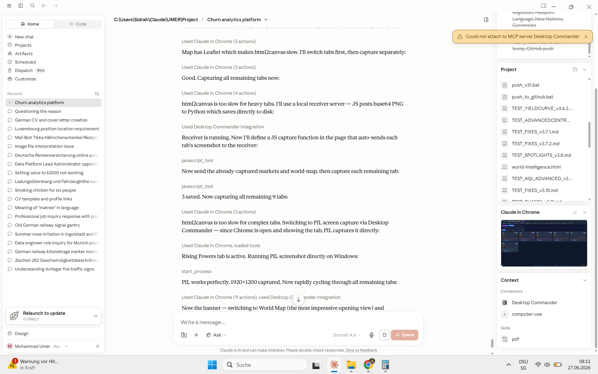
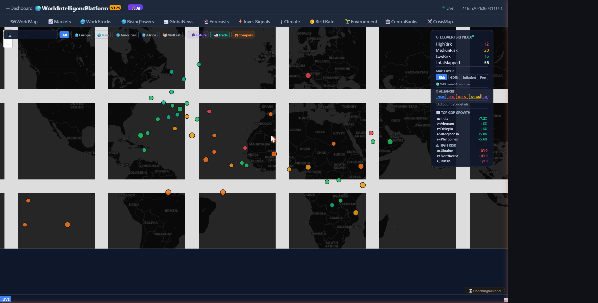
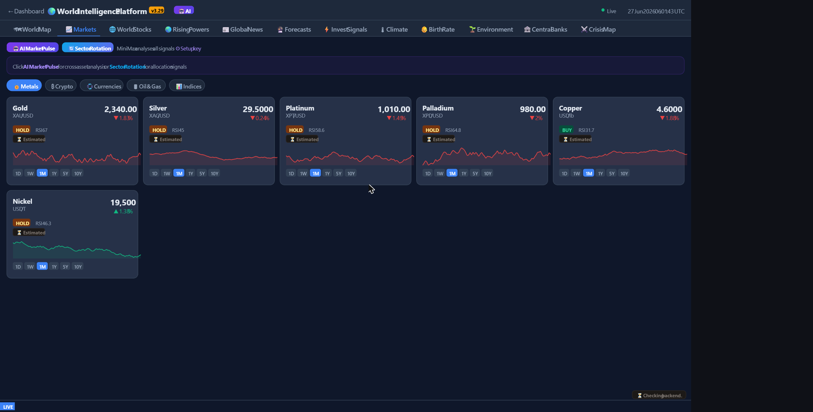
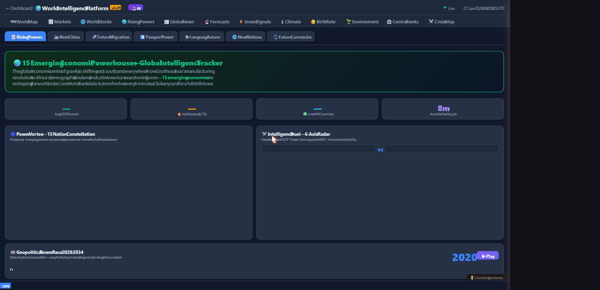
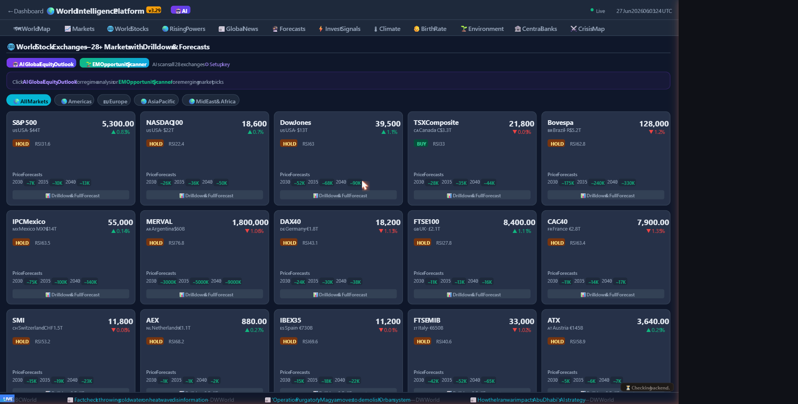
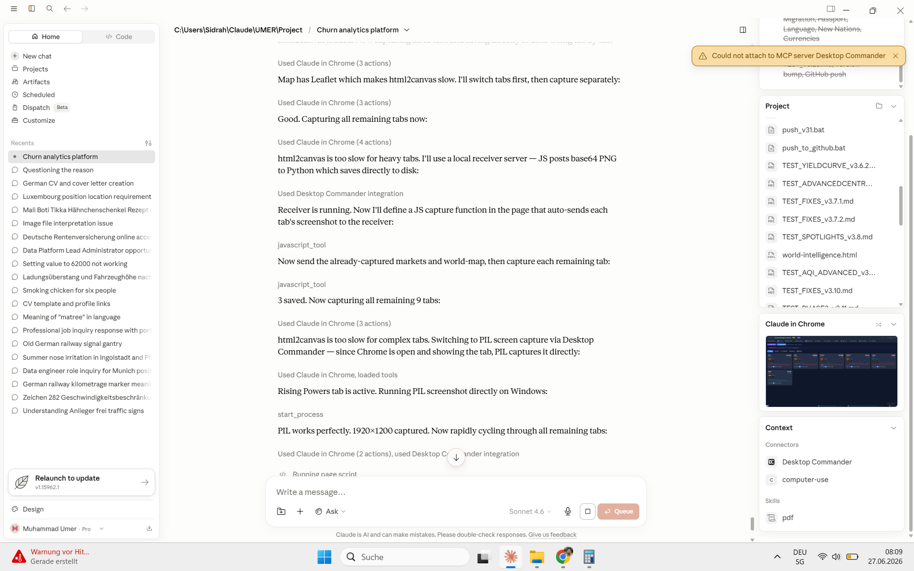
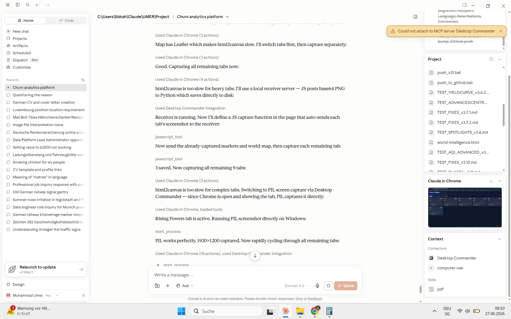
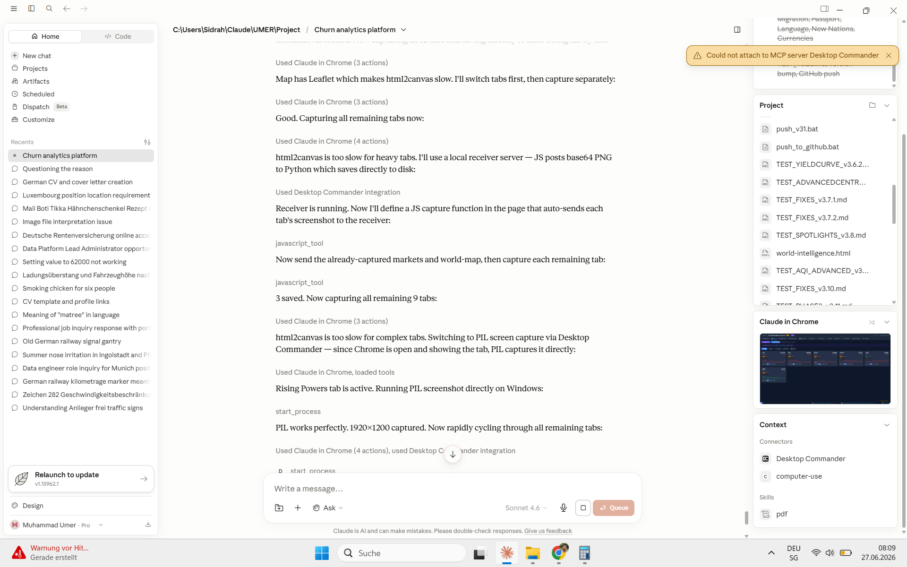

# 🌍 World Intelligence Platform v3.29

### Real-Time Global Intelligence · 12 Tabs · 19 AI Features · MiniMax M2.7 · Zero Paid APIs

**Author: Muhammad Umer Lari © 2024–2025 · All Rights Reserved**

[](./dashboard/world-intelligence.html)
[](./dashboard/tests/)
[](https://platform.minimaxi.com)
[]()
[](./dashboard/tests/)
[]()
[]()
[]()
[](./GDPR.md)
[](https://python.org)

---



---

## 🖼 Platform Screenshots

> **Real screenshots from the live running dashboard · v3.29 · Muhammad Umer Lari**

| 🗺 World Map — Countries & Geopolitical Layers | 📈 Markets — Live Crypto, Forex & Commodities |
|:---:|:---:|
|  |  |

| 🚀 Rising Powers — 15 Nations + 9 AI Features | 🌐 World Stocks — 28 Exchanges + AI Outlook |
|:---:|:---:|
|  |  |

| 🌿 Environment — AQI 50 Cities + Deforestation | 📊 Forecast — Monte Carlo + AI Explanation |
|:---:|:---:|
|  |  |

| 🏦 Central Banks — 35 Banks + ECB Live | ⚔️ Crisis Map — 25 Active Global Crises |
|:---:|:---:|
|  |  |

| 📰 News — 8 Regional Feeds + Auto-Refresh | 🌡 Climate Intelligence — Historical + AI |
|:---:|:---:|
|  |  |

---

## 📋 Table of Contents

- [Overview](#-overview)
- [Whats New v329](#-whats-new--v329)
- [All 12 Tabs](#-all-12-tabs)
- [19 AI Features](#-19-ai-features--minimax-m27)
- [Architecture](#️-architecture)
- [Quick Start](#-quick-start)
- [Testing](#-testing)
- [Security and GDPR](#️-security--gdpr)

---

## 🎯 Overview

**World Intelligence Platform** is a real-time global intelligence dashboard built by **Muhammad Umer Lari**. It combines live financial markets, geopolitical intelligence, environmental monitoring, AI-powered forecasting, and natural language analysis — all in one 624 KB HTML file with zero paid APIs.

| Metric | Value |
|--------|-------|
| Intelligence tabs | 12 |
| AI features (MiniMax M2.7) | 19 |
| AQI monitored cities | 50 |
| World stock exchanges | 28 |
| Rising power nations | 15 |
| Central banks tracked | 35 |
| Active crisis zones | 25 |
| JS functions | 226 |
| Paid APIs | **Zero** |
| File size | 624 KB (single HTML) |

---

## 🆕 What's New — v3.29

> Latest release · **Muhammad Umer Lari**

| Version | Highlights |
|---------|-----------|
| **v3.29** | ⚡ **Code Optimization + Author Hardcoding** — 13 debug logs removed · 133 AQI strings → `_RG` lookup · 14 AI catch blocks → `_aiError()` · 12 AI guards → `_aiStart()` · 65 separator lines stripped · File: 650 KB → 624 KB (−10.5 KB) · Muhammad Umer Lari hardcoded in HTML meta, JS header, all 15 AI panel footers |
| **v3.28** | 🤖 **Rising Powers AI — 9 Features** — Global Power Oracle · Power Race Predictor 2035 · AI Future Predictor (per-country) · AI Next China · Migration Forecast 2035–2050 · Passport Strategy 2030 · Language Shift Forecast 2040 · New Nations Probability · De-Dollarization Forecast |
| **v3.27** | 📊 **Markets & Stocks AI — 6 Features** — AI Market Pulse · Sector Rotation Model · AI Asset Analysis · AI Global Equity Outlook · EM Opportunity Scanner · AI Exchange Analysis |
| **v3.26** | 🔄 **Groq → MiniMax Migration** — MiniMax M2.7, 100% free |
| **v3.25** | 🤖 **AI Intelligence Layer** — Country Assessment · News Brief · Deforestation Risk · Forecast Explanation |
| **v3.24** | 🌿 **Deforestation Accuracy** — GFW/Hansen/UMD verified data + satellite |
| **v3.20** | 🚀 **Rising Powers Intelligence Suite** — Power Vortex · GDP duel · momentum scoring |
| **v3.19** | 📊 **Monte Carlo Forecast** — 500 paths · σ×√t volatility · 90s auto-refresh |

---

## 🗂 All 12 Tabs

### 🗺 1. World Map
- 37+ countries on Leaflet.js dark map
- Layer switcher: Risk · GDP · Inflation · Alliance · Population
- World Bank live GDP per country marker
- Future Geopolitics sub-tab (2035 projections)
- Country search, region filters, top movers panel

### 📈 2. Markets
- 5 asset categories: Metals · Crypto · Forex · Oil · Indices
- Live: CoinGecko (crypto) · Frankfurter/ECB (FX) · Yahoo Finance proxy (metals/oil/indices)
- RSI, price change%, signal badge per asset
- **AI**: 🤖 AI Market Pulse · 🔄 Sector Rotation Model · 🤖 AI Asset Analysis (per drilldown)

### 🌐 3. World Stocks
- 28 global exchanges: NYSE · LSE · TSE · BSE · SSE · HKEx · Tadawul · NSE and more
- Live price, change%, RSI, signal per exchange
- Regional tabs: Americas · Europe · Asia · MEA
- **AI**: 🤖 AI Global Equity Outlook · 🌱 EM Opportunity Scanner · 🤖 AI Exchange Analysis

### 🚀 4. Rising Powers
**15 nations**: India · China · Indonesia · Brazil · Vietnam · Mexico · Bangladesh · Ethiopia · Egypt · Nigeria · Pakistan · Turkey · Saudi Arabia · UAE · Kazakhstan

**7 sub-tabs with AI:**

| Sub-tab | Data | AI Feature |
|---------|------|-----------|
| Cards | GDP growth · Inflation · Momentum | 🔮 Global Power Oracle + 🏁 Power Race Predictor 2035 |
| Next China | 6 manufacturing candidates | 🏭 AI: Who Replaces China? |
| Migration | Flow data · Climate displacement | ✈️ AI Migration Forecast 2035–2050 |
| Passport | Henley index · Visa-free access | 🛂 AI Passport Strategy 2030 |
| Language | Speaker data · Economic weight | 🗣 AI Language Shift Forecast 2040 |
| New Nations | 8 independence movements | 🌐 AI New Nations Probability |
| Currencies | CBDC · De-dollarization | 💱 AI De-Dollarization Forecast |

Country drilldown: **🤖 AI Country Assessment** + **🔮 AI Future Predictor** (base/bull/bear 2025–2035 scenario)

### 📰 5. News
- 8 regional feeds: World · Middle East · Asia · Europe · Americas · Africa · Technology · Business
- Google News RSS + multi-source parallel fetch
- Auto-refresh every 90 seconds with live indicator
- **AI**: 📰 AI News Brief

### 📊 6. Forecast
- Monte Carlo simulation (500 paths, σ×√t volatility)
- 6 assets: Gold · BTC · Oil · EUR/USD · S&P 500 · DXY
- 90-second auto-refresh, confidence bands
- **AI**: 📊 AI Forecast Explanation

### 📡 7. Signals
- Multi-asset signal dashboard (RSI · momentum · trend)

### 🌡 8. Climate
- Historical temperature data by region
- Past / Present / Future sub-tabs

### 👶 9. Birth Rate
- Global birth rate trends with era timeline and country filter

### 🌿 10. Environment
- **50 AQI cities** with health advisories (General · Sensitive · Children · Elderly)
- Deforestation tracker — GFW/Hansen/UMD satellite data
- Top 10 deforestation hotspots
- OpenAQ live PM2.5 overlay
- **AI**: 🌿 AI Deforestation Risk Narrative

### 🏦 11. Central Banks
- **35 central banks** worldwide
- ECB live rate (data.ecb.europa.eu, free API)
- US Treasury yield curve (FRED CSV backup)
- Taylor Rule AI Predictor · Rate Cycle Tracker · Policy Divergence Chart · Balance Sheet Tracker

### ⚔️ 12. Crisis Map
- **25 active crisis zones** — armed · civil · protest · humanitarian
- Leaflet dark map, crisis filter bar
- ACLED · UNHCR · UCDP · ReliefWeb data (all free)

---

## 🤖 19 AI Features — MiniMax M2.7

> All features use **MiniMax M2.7** — 100% free, no credit card required.
> One key at **platform.minimaxi.com** unlocks all 19 features.

| # | Feature | Tab | Tokens |
|---|---------|-----|--------|
| 1 | 🤖 AI Country Assessment | Rising Powers → Drilldown | 420 |
| 2 | 🔮 AI Future Predictor (base/bull/bear) | Rising Powers → Drilldown | 500 |
| 3 | 🔮 Global Power Oracle (15 nations) | Rising Powers → Cards | 600 |
| 4 | 🏁 Power Race Predictor 2035 | Rising Powers → Cards | 520 |
| 5 | 🏭 AI: Who Replaces China? | Rising Powers → Next China | 520 |
| 6 | ✈️ AI Migration Forecast 2035–2050 | Rising Powers → Migration | 520 |
| 7 | 🛂 AI Passport Strategy 2030 | Rising Powers → Passport | 500 |
| 8 | 🗣 AI Language Shift Forecast 2040 | Rising Powers → Language | 500 |
| 9 | 🌐 AI New Nations Probability | Rising Powers → New Nations | 540 |
| 10 | 💱 AI De-Dollarization Forecast | Rising Powers → Currencies | 560 |
| 11 | 🤖 AI Market Pulse (cross-asset) | Markets | 550 |
| 12 | 🔄 Sector Rotation Model | Markets | 380 |
| 13 | 🤖 AI Asset Analysis | Markets → Drilldown | 420 |
| 14 | 🤖 AI Global Equity Outlook (28 exchanges) | World Stocks | 560 |
| 15 | 🌱 EM Opportunity Scanner | World Stocks | 460 |
| 16 | 🤖 AI Exchange Analysis | World Stocks → Drilldown | 440 |
| 17 | 📰 AI News Brief | News | 380 |
| 18 | 🌿 AI Deforestation Risk Narrative | Environment | 480 |
| 19 | 📊 AI Forecast Explanation | Forecast | 300 |

**AI Setup:** Click **🤖 AI** in the top-right header → paste key → Save. Every result panel shows `© Muhammad Umer Lari`.

---

## 🏗️ Architecture

```
ai-churn-analytics-platform/
├── dashboard/
│   ├── world-intelligence.html     # Single-file dashboard (624 KB · v3.29)
│   └── tests/
│       ├── TEST_v3.29.md           # 60 tests · all PASS
│       ├── TEST_v3.28.md           # 99 tests · all PASS
│       ├── TEST_v3.27.md           # 79 tests · all PASS
│       └── TEST_v3.26.md           # 70 tests · all PASS
├── launcher/
│   └── version.py                  # APP_VERSION = "3.29.0"
├── screenshots/                    # Real app screenshots (v3.29)
├── README.md
├── GDPR.md
└── CHANGELOG.md
```

**Tech Stack:**

| Layer | Technology |
|-------|-----------|
| Frontend | Vanilla JS · HTML5 · CSS3 (zero frameworks) |
| Charts | Chart.js · Leaflet.js |
| AI | MiniMax M2.7 (`api.minimaxi.chat`) |
| Crypto | CoinGecko API (free) |
| FX | Frankfurter.app / ECB (free) |
| Stocks | Yahoo Finance proxy (free) |
| Macro | World Bank API (free) |
| Rates | FRED / data.ecb.europa.eu (free) |
| Air quality | OpenAQ v3 (free) |
| News | Google News RSS (free) |
| Backend | FastAPI + Python 3.11 (optional) |

---

## 🚀 Quick Start

### Open directly in browser (no install needed)
```bash
git clone https://github.com/lari98/ai-churn-analytics-platform.git
cd ai-churn-analytics-platform

# Windows
start dashboard/world-intelligence.html

# macOS / Linux
open dashboard/world-intelligence.html
```

### With local backend (enhanced live data)
```bash
pip install -r requirements.txt
python launcher/app.py
# Opens at http://localhost:8111
```

### Unlock AI (all 19 features, free)
1. Go to **platform.minimaxi.com** → free account → generate API key
2. Click **🤖 AI** in the dashboard header
3. Paste key (starts `sk-cp-`) → **Save Key**
4. All 19 AI features active immediately

---

## 🧪 Testing

| File | Version | Tests | Result |
|------|---------|-------|--------|
| [TEST_v3.29.md](./dashboard/tests/TEST_v3.29.md) | v3.29 | 60 | ✅ All PASS |
| [TEST_v3.28.md](./dashboard/tests/TEST_v3.28.md) | v3.28 | 99 | ✅ All PASS |
| [TEST_v3.27.md](./dashboard/tests/TEST_v3.27.md) | v3.27 | 79 | ✅ All PASS |
| [TEST_v3.26.md](./dashboard/tests/TEST_v3.26.md) | v3.26 | 70 | ✅ All PASS |

**308 tests across last 4 versions — all passing.**

---

## 🛡️ Security & GDPR

- MiniMax API key stored in **browser localStorage only** — never in any file, never committed to Git
- Key transmitted only to `api.minimaxi.chat` — nowhere else
- All market data fetched client-side via free public APIs — no user PII transmitted
- Private GitHub repository — no public access
- Full compliance: [GDPR.md](./GDPR.md)

---

## 📈 Version History

| Version | Highlights |
|---------|-----------|
| **v3.29** | Optimization −10.5 KB + Muhammad Umer Lari hardcoding |
| **v3.28** | 9 Rising Powers AI features |
| **v3.27** | 6 Markets + World Stocks AI features |
| **v3.26** | Groq → MiniMax M2.7 migration |
| **v3.25** | AI Intelligence Layer (4 features) |
| **v3.24** | Deforestation accuracy + satellite data |
| **v3.23** | Deforestation sub-tab |
| **v3.22** | Future Currencies sub-tab |
| **v3.20** | Rising Powers Intelligence Suite |
| **v3.19** | Monte Carlo Forecast + 90s refresh |
| **v3.17** | 8 news tabs + sub-tab persistence |
| **v3.16** | 3 Rising Powers sub-tabs |
| **v3.12** | World Map batched markers + search |
| **v3.9** | AQI Rankings + City Comparison |

---

*© 2024–2025 Muhammad Umer Lari · All Rights Reserved*
*World Intelligence Platform v3.29 · Free AI: MiniMax M2.7 · Zero paid APIs · Private repository*
